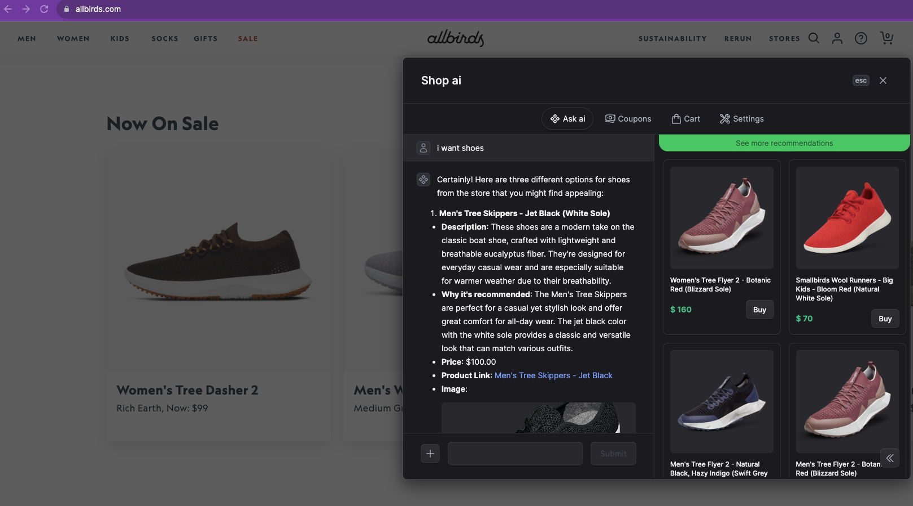

## Shop ai (WIP)

Power your shopify sites with ai.

## Installation

1. cd browser-extension
2. pnpm i
3. pnpm build chrome (this will create a dist/chrome folder)
4. load the chrome folder into the browser.

Server:

1. cd server
2. pnpm i
3. pnpm dev

## TODOS

- [x] index all products in a shop
- [x] check if the page is on a product page
- [x] check if the product is on a collection page
- [x] check if the product is on main page

- [x] if the product is on product page.
- [x] search recommendations
- [x] double check to see the
- [x] improve results quality v1
- [x] conversational mode
- [x] update ui v1
- [ ]

## Embedding cues

- [x] color
- [x] size
- [x] title
- [x] collection
- [x] tags
- [x] gender
- [x] product_type
- [x] enforce higher accuracy on embeddings

## updates

2. create 3 new apis.
   a. create a new thread,
   b. upload files
   c. chat with assistant.
   d. update assistant and update files
